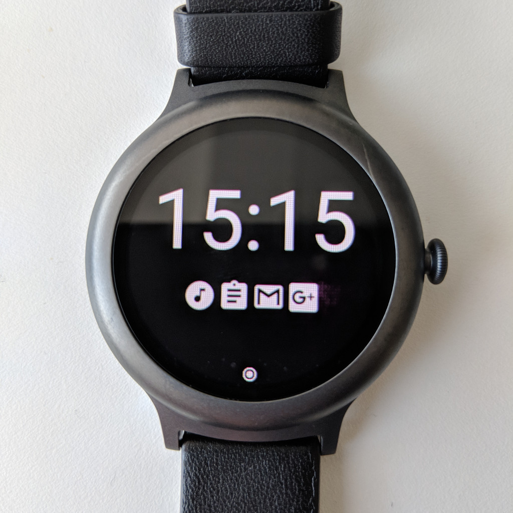
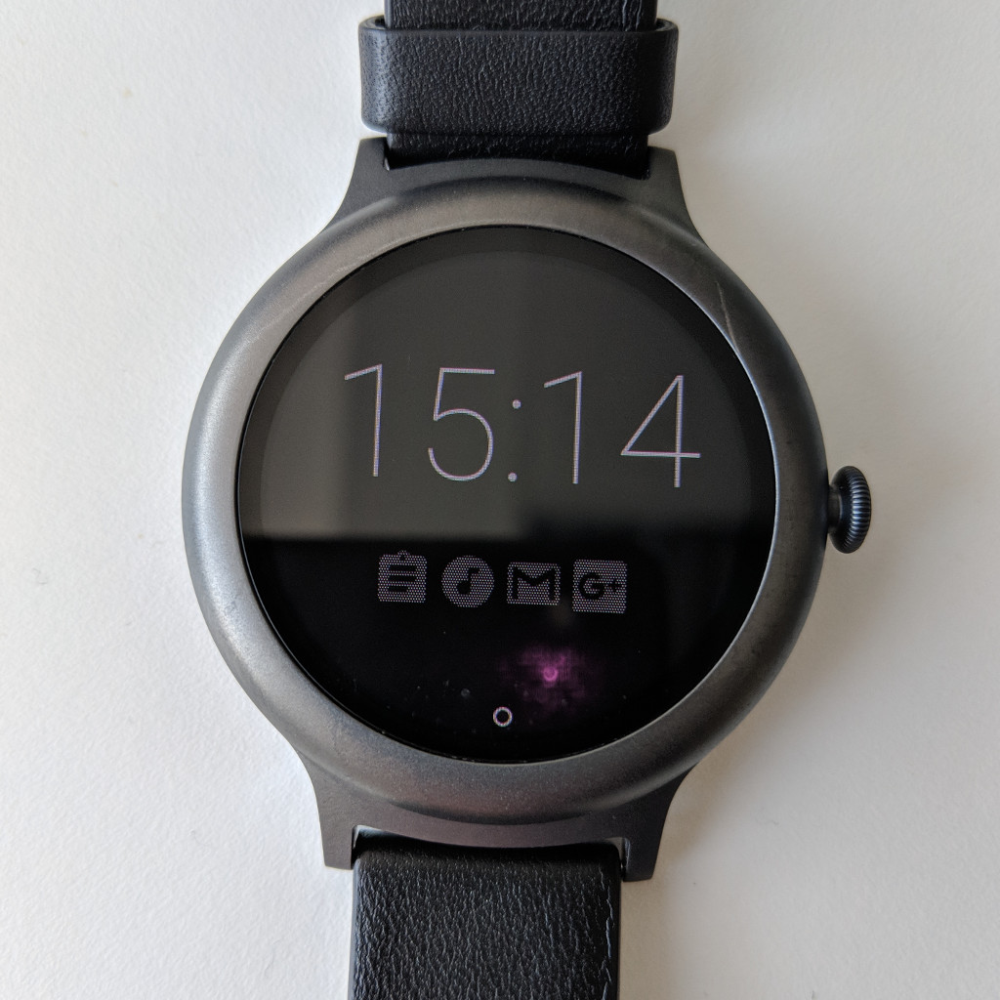

# Wear OS Notifications Watch Face

This is a Wear OS watch face that displays the notification icons from your phone on your watch. To do that it requires a companion app to run on the phone. Here's what it looks like:

Feel free to use and modify this, but if you're going to publish it on the Play Store, please change the package name to something that doesn't start with `org.jfedor`.

If you have any questions or comments, you can email me at jfedor@jfedor.org.
